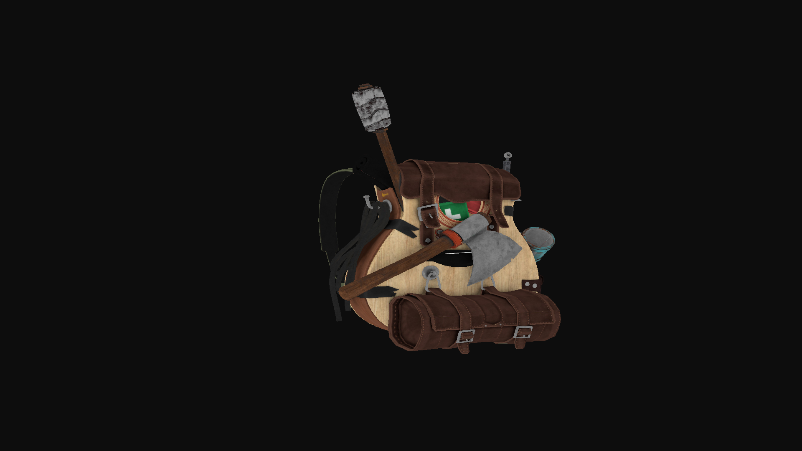

## OpenGL Learning Journey

This repository documents my hands-on journey learning **OpenGL**, following the excellent guide at
[learnopengl.com](https://learnopengl.com/).

I started from the **Getting Started** section and progress topic by topic, focusing on understanding what’s happening under the hood rather than just making things render.

### Branch Structure

Each major topic or chapter is developed on its own branch.
Switch branches depending on what concept you’re exploring or reviewing.

### Project Layout Notes

* **Shaders**

  * The `shaders/` directory is expected to live inside the **build directory**.
  * Shader paths are configured to be **relative to the executable**, which is generated in `build/`.
  * The folder is kept outside `build/` in the repo so it can be tracked by Git—just copy it into `build/` before running.

* **Resources / Models**

  * When you reach the **model loading** section, the `resources/` directory should also be placed inside the `build/` directory.
  * This folder is **not tracked by Git** because of its size.

### Goal

This isn’t a polished engine or framework.
It’s a learning log—experiments, mistakes, fixes, and incremental understanding while working through modern OpenGL.

> It's not easy but I did go through it, heres something that you can be able to achive when following learnOpengl.com

